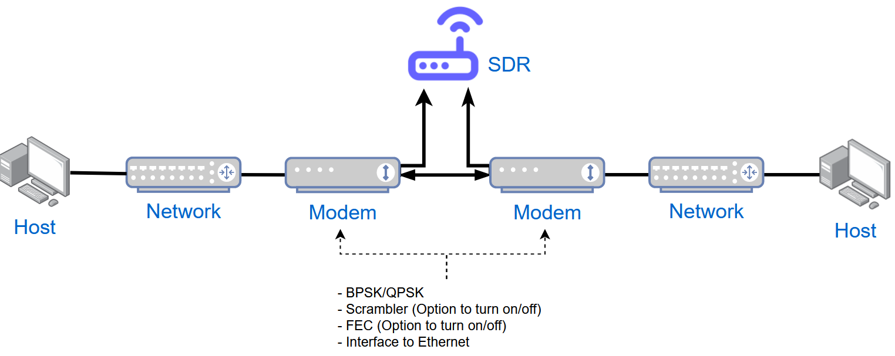

# Comtech CDM600 GNURadio Demod

## Introduction
---
This project implements a BPSK and QPSK demod/decode of the Comtech CDM600 using an LimeSDR (easily adaptable to other SDRs like the RTL-SDR) and GNURadio. Its does this by 'intercepting' and processing the RF signal to produce the network traffic as generated between two hosts.

The inspiration for this project came from a website authored by Red Ballon Security as part of the DEFCON 2020 Hack-A-Satellite Space Security Challenge. [Chapter 7](https://nyan-sat.com/chapter7.html) of this website mentions using a USRP N210 and GNURadio to process the BPSK signalling sent from a Comtech CDM600 satellite modem. Still not quite sure how their implementation functioned.. I found it to be lacking in detail/technically it seemed to be missing important signal processing stages (like symbol sync and deframing..)

## Setup
---
### Equipment List
Full list of equipment can be found [here.](docs/equipment_list.txt)

### Overview

### Connectivity Diagram
#### Front

#### Back

### Network configuration
See [here](networking_config/README.md) for details on how to configure the Cisco 2811 network devices. This includes how to make the required DB15(M)-to-RJ48 serial cable.

### CDM600 configuration and GNURadio flowgraphs
For details on how to configure the CDM600s and run the GNURadio flowgraphs, see:
 * [BPSK Configuration](gnuradio_flowgraphs/bpsk/README.md)
 * [QPSK Configuration](gnuradio_flowgraphs/qpsk/README.md)

## Network throughput test

Using: [KootNet Network Testers](https://github.com/chad-ermacora/rp-network-testers)

## Helpful material
---
 * https://github.com/ryanvolz/radioconda
 * https://destevez.net
 * https://wiki.gnuradio.org/index.php/Guided_Tutorial_PSK_Demodulation
 * https://academic.csuohio.edu/yuc/mobile/mcproj/3d-GNU%20Radio_Steve%20&%20Bhaumil.pdf
 * https://www.gnuradio.org/grcon/grcon17/presentations/building_a_moderately_complex_mode_with_spare_parts/Dan-CaJacob-Building-a-Moderately-Complex-Modem-with-Spare-Parts.pdf