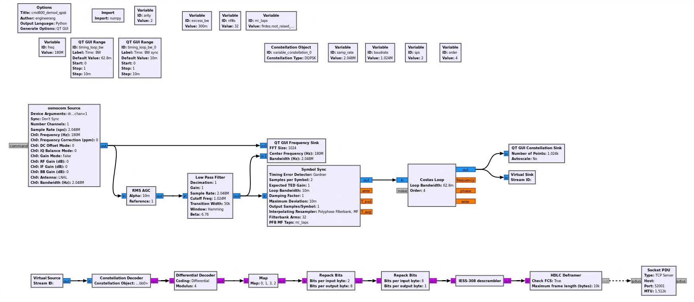
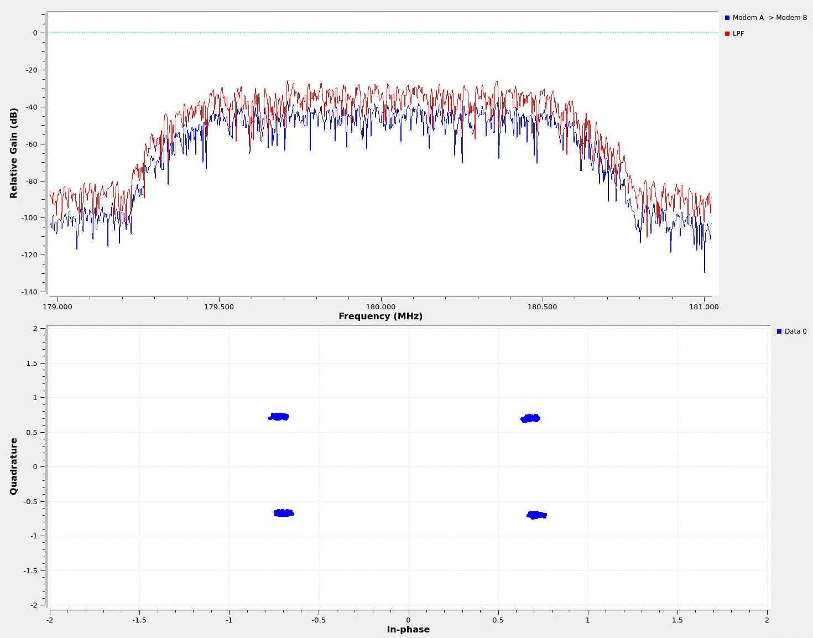
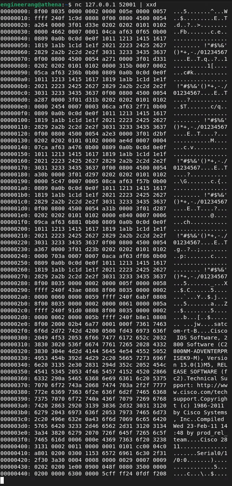

# CDM600 QPSK Demod



## CDM600 Setup 
 * QPSK 
 * Differential Encoding
 * No FEC 
 * Scrambling enabled
 * G703 Balanced E1
 * 1024K Baud (2048Kbps)
 * Carrier @ 180MHz

````
# Commands to configure from start up on both CDM600s
ENT (exit startup screen)
ENT (enter CONFIGURATION)
ENT (enter CONFIG:ALL)
UP+ENT  (select START)
DOWN+DOWN+DOWN (select MODE:Tx=G703B)
RIGHT (select MODE:Tx=G703B:NONE)
RIGHT+DOWN+DOWN+DOWN (select MODE:Tx=G703B)
ENT (select MODE:Tx=G703B:NONE)
DOWN  (select TX-IF: CARRIER=ON)
RIGHT+ENT (select TX-IF: TX FREQ=180MHz)
RIGHT+DOWN+ENT (select OUTPUT POWER: OUTPUT POWER LEVEL=-20)
DOWN+ENT (select ENCODER=NONE)
ENT (select MODULATION=QPSK FEC RATE=1/1)
UP+ENT (select TX DATA RATE=02048Kbps)
ENT (select TX SCRAMBLER=NORMAL)
RIGHT+ENT (select RX FREQ=180MHz)
DOWN+ENT (select DECODER=NONE)
ENT (select DEMODULATION=QPSK FEC RATE=1/1)
UP+ENT (select RX DATA RATE=02048Kbps)
ENT (select RX SCRAMBLER=NORMAL)
ENT+ENT+ENT (misc RX config)
ENT (select TxG703/DDO CODE=HDB3 & RxG703/IDI CODE=HDB3)
````
## Run the flowgraph
````
gnuradio-companion cdm600_demod_qpsk.grc
````


## Connect to the socket to get network traffic
```
nc 127.0.0.1 52001 | xxd
```

