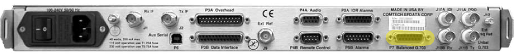
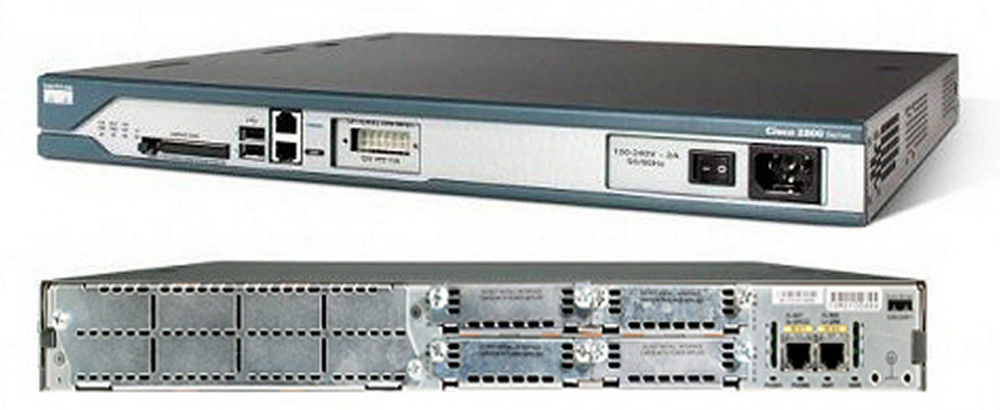
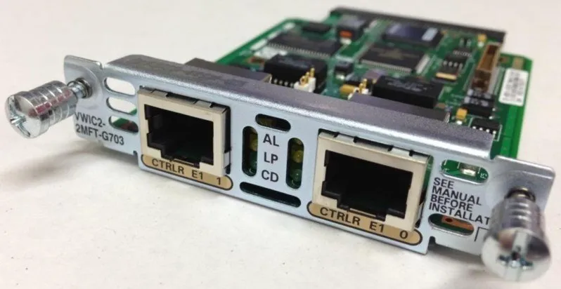
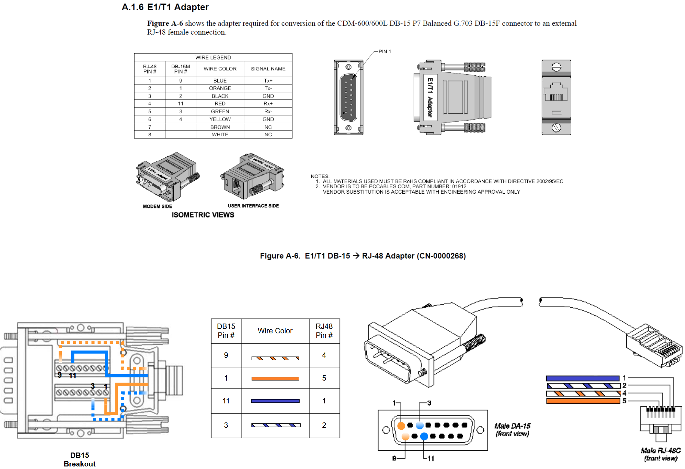

# Cisco 2811 Networking

## Overview

## G703 E1/T1 interface
The CDM600 does not directly have an Ethernet interface though it does supports G.703 T1/E1 via a D15 connector. This will mean a Cisco router and WAN interface card will be required to act as an intermediary between the host and the satellite modem. 

The Cisco 2811 ISR supports a wide range of [WAN interface cards](https://en.wikipedia.org/wiki/WAN_Interface_Card) (VWIC) namely a [T1/E1 G.703 VWIC](https://www.router-switch.com/cisco-vwic2-2mft-g703-datasheet-pdf.html).

 
 

---
❕ **NOTE** ❕

It is absolutely necessary that you use a **VWIC2-1MFT-G703** or **VWIC2-2MFT-G703** card! G.703 specifies that the T1/E1 will be "unframed" which is not supported by the VWIC2-1MFT-T1/E1 or VWIC2-2MFT-T1/E1 cards (trust me..I tried).

---

## Making the E1/T1 DB-15(M) to RJ48 cables
Very specific connectors/pinouts will be required to connect the CDM600 to the G703 VWIC on the Cisco Router. If you have trouble sourcing a cable (like I did), you can make one as described below. 

## iOS Configure Commands
These commands enable the G703 interface and configure the network as described in the overview on the Cisco 2811 ISR.

[Router A](Router_A_G703_WIC_CONFIGURE.txt)

[Router B](Router_B_G703_WIC_CONFIGURE.txt)
