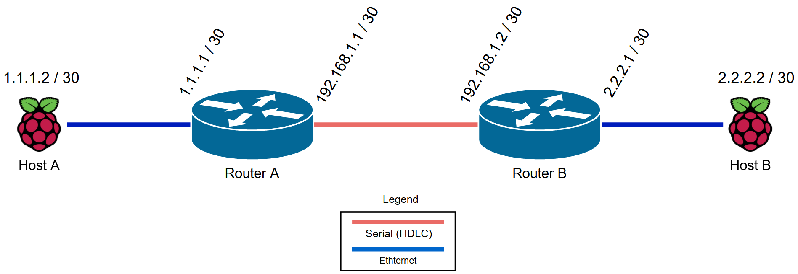

# Cisco 2811 Networking

## Overview

## iOS Configure Commands
[Router A](Router_A_G703_WIC_CONFIGURE.txt)

[Router B](Router_B_G703_WIC_CONFIGURE.txt)

## Making the E1/T1 DB-15(M) to RJ48 cables

